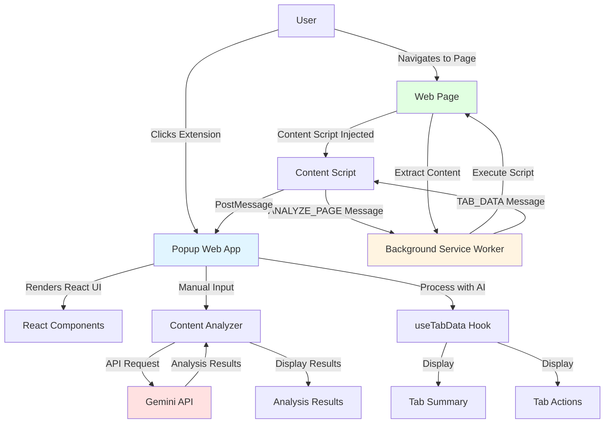
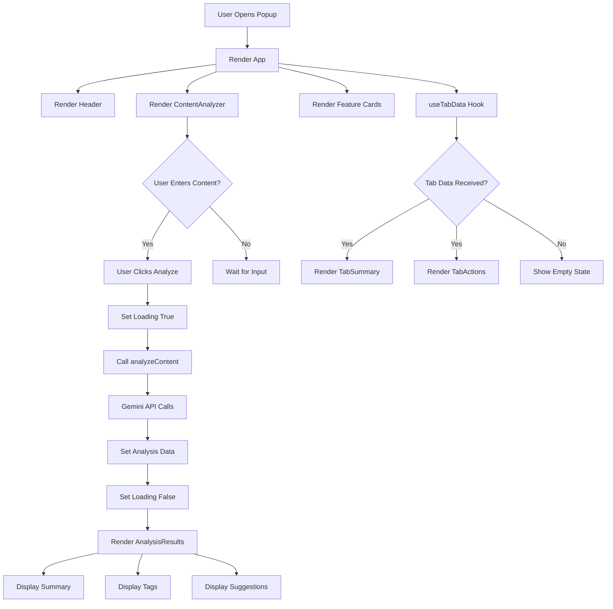
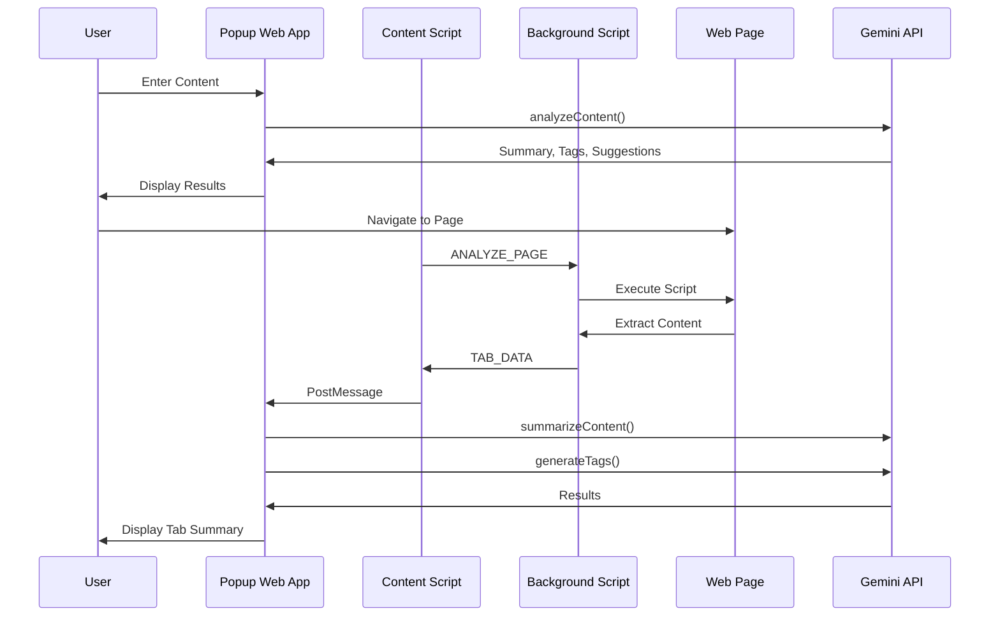
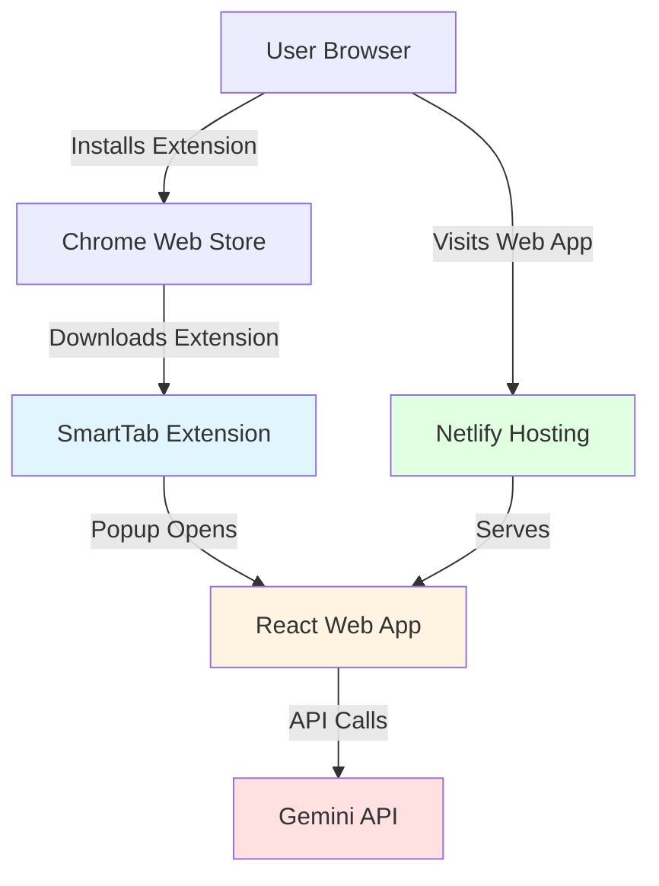
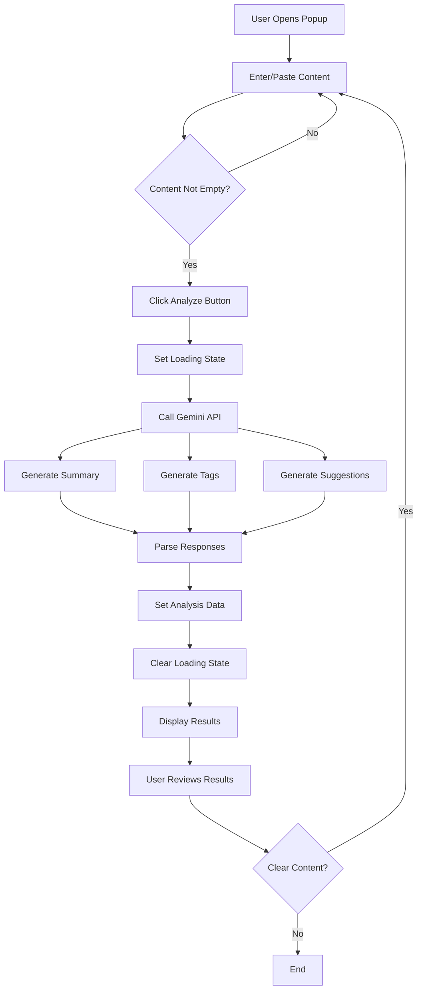
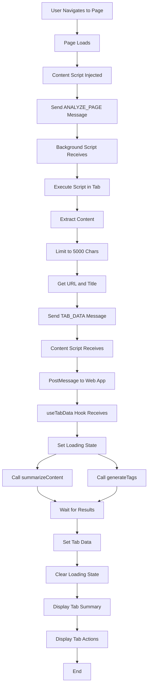
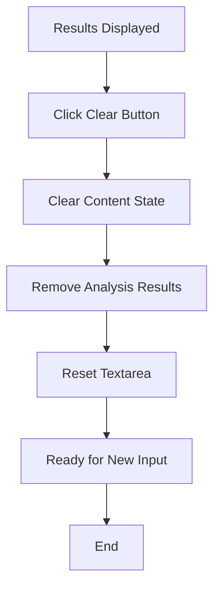
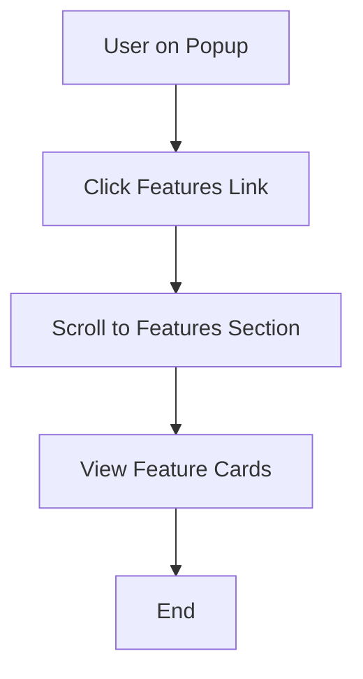
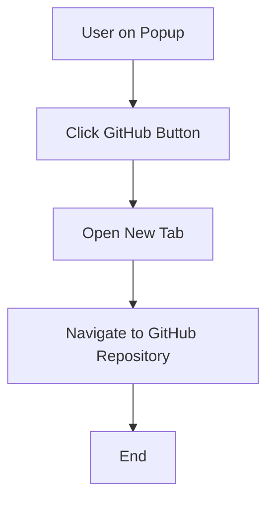

# SmartTab - AI-Powered Tab Management System Documentation

## Table of Contents

1. [Executive Summary](#executive-summary)
2. [Project Overview](#project-overview)
3. [Functional Features](#functional-features)
4. [System Architecture](#system-architecture)
5. [Technology Stack](#technology-stack)
6. [Folder Structure Documentation](#folder-structure-documentation)
7. [Database Documentation](#database-documentation)
8. [API Documentation](#api-documentation)
9. [Authentication & Authorization](#authentication--authorization)
10. [Frontend Documentation](#frontend-documentation)
11. [Backend Documentation](#backend-documentation)
12. [Configuration Documentation](#configuration-documentation)
13. [Deployment Documentation](#deployment-documentation)
14. [Security Documentation](#security-documentation)
15. [User Workflow Documentation](#user-workflow-documentation)
16. [Admin Workflow Documentation](#admin-workflow-documentation)
17. [Repository Analysis Summary](#repository-analysis-summary)

---

## 1. Executive Summary

### Project Name
SmartTab - AI-Powered Tab Management and Content Analysis

### Project Purpose
SmartTab is a Chrome browser extension that leverages AI capabilities to provide intelligent tab management and content analysis. The system enables users to analyze web page content, generate summaries, extract key topics, and receive AI-powered suggestions directly within the browser.

### Problem Statement
Users often struggle with managing multiple browser tabs and quickly extracting meaningful information from web content. The challenge is to efficiently distill key information from extensive content, helping users gain insights and generate ideas faster without leaving their browsing context.

### Target Users
- Researchers and academics who need to quickly summarize web content
- Content creators looking for topic extraction and insights
- Professionals managing multiple tabs and needing quick content overviews
- Students conducting research across multiple web pages
- Anyone seeking to improve productivity through AI-assisted content understanding

### High-Level Solution
SmartTab integrates Chrome's built-in AI capabilities with the Google Gemini API to provide:
- Real-time content analysis of active tabs
- Automatic summarization of web page content
- Intelligent tagging and topic extraction
- AI-powered suggestions and insights
- A popup interface for quick access to analysis results

### Core Value Proposition
- **Efficiency**: Instant content analysis without leaving the browser
- **Intelligence**: AI-powered summaries, tags, and suggestions
- **Convenience**: Popup-based interface for seamless integration
- **Privacy**: Local processing with Chrome's built-in AI capabilities
- **Productivity**: Quick insights from multiple tabs

---

## 2. Project Overview

### What the System Does
SmartTab is a Chrome browser extension that:
- Monitors the active tab in the browser
- Extracts text content from web pages
- Sends content to AI models for analysis
- Generates summaries, tags, and suggestions
- Displays results in a popup interface
- Provides action buttons for summarization, bookmarking, and sharing

### Why It Exists
The system exists to address the need for efficient content consumption and understanding directly within the browser. It was developed for the Google Chrome Built-in AI Challenge to demonstrate the possibilities of Chrome's built-in AI capabilities for enhancing productivity.

### Primary Use Cases
1. **Content Summarization**: Users can quickly get a summary of any web page they are viewing
2. **Topic Extraction**: Automatic generation of relevant tags and topics from page content
3. **Smart Insights**: AI-powered suggestions based on page content
4. **Tab Management**: Overview of active tab content with analysis
5. **Content Sharing**: Share pages with AI-generated summaries

### Main Workflows

#### Web App Workflow
1. User opens the SmartTab popup
2. User enters or pastes content in the text area
3. User clicks "Analyze Content"
4. System sends content to Gemini API
5. System displays summary, tags, and suggestions
6. User can clear content and analyze new text

#### Extension Workflow
1. User navigates to a web page
2. Content script sends analysis request to background script
3. Background script extracts page content (limited to 5000 characters)
4. Background script sends tab data back to content script
5. Content script forwards data to the web app via window.postMessage
6. Web app processes data with AI functions
7. Results are displayed in the popup

### User Journey Descriptions

#### Journey 1: Manual Content Analysis
- User opens SmartTab popup
- User pastes article text into the content analyzer
- User clicks "Analyze Content"
- System shows loading animation
- System displays summary, key topics, and AI suggestions
- User reviews insights and can clear to analyze new content

#### Journey 2: Tab Analysis (Extension Mode)
- User navigates to a web page
- Extension automatically captures page content
- Content script triggers analysis
- Background script extracts URL, title, and content
- Data is forwarded to the web app
- Web app displays tab summary and available actions
- User can trigger summarize, bookmark, or share actions

---

## 3. Functional Features

### Feature 1: Content Analysis

**Description**: Users can manually input or paste text content for AI-powered analysis.

**User Actions**:
- Enter or paste content in the textarea
- Click "Analyze Content" button
- Click "Clear" button to reset

**System Actions**:
- Validates content is not empty
- Sends content to Gemini API via `analyzeContent()` function
- Makes three parallel API calls for summary, tags, and suggestions
- Parses API responses
- Updates state with analysis results
- Displays loading state during processing

**Related Components**:
- `ContentAnalyzer.tsx`
- `AnalysisResults.tsx`
- `ai.ts` (utility)

**Dependencies**:
- Google Gemini API
- React state management

---

### Feature 2: Summary Generation

**Description**: Generates concise summaries of analyzed content using AI.

**User Actions**:
- View summary in the AnalysisResults component
- Summary appears automatically after analysis completes

**System Actions**:
- Calls `makeGeminiRequest()` with summary prompt
- Extracts text from API response
- Displays summary in a styled card

**Related Components**:
- `AnalysisResults.tsx`
- `ai.ts`

**Dependencies**:
- Google Gemini API

---

### Feature 3: Tag Generation

**Description**: Automatically generates relevant tags and topics from content.

**User Actions**:
- View tags in the AnalysisResults component
- Tags appear as clickable-style badges

**System Actions**:
- Calls `makeGeminiRequest()` with tag generation prompt
- Parses comma-separated response
- Maps to array of strings
- Displays as styled badges

**Related Components**:
- `AnalysisResults.tsx`
- `ai.ts`

**Dependencies**:
- Google Gemini API

---

### Feature 4: AI Suggestions

**Description**: Provides AI-powered insights and suggestions based on content.

**User Actions**:
- View suggestions in the AnalysisResults component
- Suggestions appear as bullet points

**System Actions**:
- Calls `makeGeminiRequest()` with suggestions prompt
- Parses bullet-point response
- Cleans formatting (removes bullets, filters empty lines)
- Displays as styled list items

**Related Components**:
- `AnalysisResults.tsx`
- `ai.ts`

**Dependencies**:
- Google Gemini API

---

### Feature 5: Tab Content Extraction

**Description**: Extracts content from the active browser tab for analysis.

**User Actions**:
- Navigate to any web page
- Extension automatically triggers content extraction

**System Actions**:
- Content script sends 'ANALYZE_PAGE' message to background
- Background script executes script in active tab
- Script extracts `document.body.innerText` (limited to 5000 characters)
- Extracts `window.location.href` and `document.title`
- Returns data to background script
- Background script sends 'TAB_DATA' message back

**Related Components**:
- `background.js`
- `content.js`

**Dependencies**:
- Chrome Scripting API
- Chrome Runtime API

---

### Feature 6: Tab Data Forwarding

**Description**: Forwards extracted tab data from extension to web app.

**User Actions**:
- No direct user action - automatic

**System Actions**:
- Content script listens for 'TAB_DATA' messages
- Forwards data via `window.postMessage(message, '*')`
- Web app listens for window messages
- Processes data with AI functions

**Related Components**:
- `content.js`
- `useTabData.ts` hook

**Dependencies**:
- Chrome Runtime API
- Window PostMessage API

---

### Feature 7: Tab Summary Display

**Description**: Displays summary of active tab content in the popup.

**User Actions**:
- View current URL and content summary
- See "Generating summary..." state during processing

**System Actions**:
- Receives tab data from useTabData hook
- Displays URL and summary in styled cards
- Shows loading state when summary is being generated

**Related Components**:
- `TabSummary.tsx`
- `useTabData.ts`

**Dependencies**:
- React state management

---

### Feature 8: Tab Actions

**Description**: Provides action buttons for tab management (placeholder implementation).

**User Actions**:
- Click "Summarize Content" button
- Click "Smart Bookmark" button
- Click "Share with Summary" button

**System Actions**:
- Logs action to console
- Implementation marked as using Chrome's built-in AI APIs (not implemented)

**Related Components**:
- `TabActions.tsx`

**Dependencies**:
- None (placeholder implementation)

---

### Feature 9: Loading States

**Description**: Displays loading animations during AI processing.

**User Actions**:
- Observe loading states during analysis

**System Actions**:
- Sets loading state to true before API calls
- Displays skeleton loaders in AnalysisResults
- Sets loading state to false after completion

**Related Components**:
- `AnalysisResults.tsx`
- `ContentAnalyzer.tsx`
- `useTabData.ts`

**Dependencies**:
- React state management

---

### Feature 10: Responsive Header

**Description**: Displays application header with navigation links.

**User Actions**:
- Click "Features" anchor link
- Click "About" anchor link
- Click "GitHub" link (opens in new tab)

**System Actions**:
- Navigates to anchor sections
- Opens GitHub repository in new tab

**Related Components**:
- `Header.tsx`

**Dependencies**:
- None

---

## 4. System Architecture

### Architecture Overview

SmartTab follows a Chrome Extension architecture with a React-based popup interface. The system consists of:

- **Background Service Worker**: Handles extension-level events and script execution
- **Content Script**: Injected into web pages to extract content
- **Popup Web App**: React application for user interface
- **AI Integration**: Google Gemini API for content analysis

### Architecture Diagram



### Frontend Architecture

The frontend is a single-page React application with the following structure:

- **Component-Based**: Modular React components with clear separation of concerns
- **State Management**: React hooks (useState, useEffect) for local state
- **Custom Hooks**: useTabData for tab data management
- **Utility Functions**: AI-related functions in utils/ai.ts
- **TypeScript**: Full type safety with TypeScript interfaces

### Backend Architecture

The system does not have a traditional backend. Instead, it uses:

- **Chrome Extension APIs**: For browser-level functionality
- **Background Service Worker**: For script execution and message passing
- **Google Gemini API**: External AI service for content analysis
- **Chrome Storage API**: For data persistence (permission granted but not implemented)

### Database Architecture

No traditional database is used. The system relies on:

- **Chrome Storage API**: Permission granted for storage, but no implementation found
- **In-Memory State**: React state for temporary data
- **API Responses**: Data from Gemini API is not persisted

### External Services

#### Google Gemini API
- **Purpose**: Content analysis, summarization, tag generation, suggestions
- **Endpoint**: `https://generativelanguage.googleapis.com/v1/models/gemini-pro:generateContent`
- **Authentication**: API key (placeholder in code)
- **Usage**: Three parallel requests per analysis (summary, tags, suggestions)

### Third-Party Integrations

- **Chrome Extension APIs**: Scripting, Runtime, Storage, ActiveTab
- **Lucide React**: Icon library for UI components
- **Tailwind CSS**: Utility-first CSS framework for styling

---

## 5. Technology Stack

### Frontend

#### Framework
- **React 18.3.1**: UI library for building the popup interface
- **TypeScript 5.5.3**: Type-safe JavaScript superset

#### Libraries
- **Lucide React 0.344.0**: Icon library (Brain, Sparkles, MessageSquare, FileText, Tag, Lightbulb, Upload, X, Wand2, Github, Bookmark, Share2, Link)
- **React DOM 18.3.1**: React DOM renderer

#### UI Components
- **Tailwind CSS 3.4.1**: Utility-first CSS framework
- **PostCSS 8.4.35**: CSS transformation tool
- **Autoprefixer 10.4.18**: CSS vendor prefixing

#### Build Tools
- **Vite 5.4.2**: Build tool and development server
- **@vitejs/plugin-react 4.3.1**: Vite plugin for React

### Backend

#### Framework
- **Chrome Extension Manifest V3**: Extension framework
- **JavaScript (ES6)**: For background and content scripts

#### Runtime
- **Chrome Browser**: Extension runtime environment
- **V8 JavaScript Engine**: Chrome's JavaScript engine

#### Libraries
- **Chrome Extension APIs**: Native browser APIs
  - chrome.runtime
  - chrome.scripting
  - chrome.storage (permission granted, not implemented)

### Database

**Type**: No database implementation found

**ORM**: None

**Schema Tools**: None

**Note**: Chrome Storage API permission is granted in manifest.json but no storage implementation exists in the codebase.

### DevOps

#### Hosting
- **Netlify**: Live deployment mentioned in README (https://stellular-kheer-8afbc5.netlify.app/)

#### CI/CD
- **None**: No CI/CD configuration found in repository

#### Deployment Tools
- **Vite Build**: `npm run build` command
- **Chrome Extension**: Manual loading in developer mode

### Other Services

#### Authentication
- **None**: No authentication system implemented

#### Storage
- **Chrome Storage API**: Permission granted but not implemented
- **React State**: In-memory state management

#### Notifications
- **None**: No notification system implemented

#### APIs
- **Google Gemini API**: AI content analysis
  - Model: gemini-pro
  - Endpoint: generativelanguage.googleapis.com
  - Authentication: API key (placeholder)

---

## 6. Folder Structure Documentation

```
dev/
├── .git/                          # Git version control directory
├── .gitattributes                 # Git attributes configuration
├── .gitignore                     # Git ignore patterns
├── LICENSE                        # MIT License file
├── README.md                      # Project documentation
├── background.js                  # Chrome extension background service worker
├── content.js                     # Chrome extension content script
├── eslint.config.js               # ESLint configuration
├── index.html                     # HTML entry point for popup
├── manifest.json                  # Chrome extension manifest
├── package-lock.json              # NPM dependency lock file
├── package.json                   # NPM package configuration
├── postcss.config.js              # PostCSS configuration
├── src/                           # Source code directory
│   ├── components/                # React components
│   │   ├── AnalysisResults.tsx    # Displays analysis results (summary, tags, suggestions)
│   │   ├── ContentAnalyzer.tsx    # Content input and analysis trigger component
│   │   ├── Header.tsx             # Application header with navigation
│   │   ├── TabActions.tsx         # Tab action buttons (placeholder implementation)
│   │   └── TabSummary.tsx         # Displays tab summary information
│   ├── hooks/                     # Custom React hooks
│   │   └── useTabData.ts          # Hook for managing tab data from extension
│   ├── utils/                     # Utility functions
│   │   └── ai.ts                  # AI integration functions (Gemini API calls)
│   ├── App.tsx                    # Main application component
│   ├── index.css                  # Global CSS with Tailwind directives
│   ├── main.tsx                   # React application entry point
│   ├── types.ts                   # TypeScript type definitions
│   └── vite-env.d.ts              # Vite environment type definitions
├── tailwind.config.js             # Tailwind CSS configuration
├── tsconfig.app.json              # TypeScript configuration for app code
├── tsconfig.json                  # Root TypeScript configuration
├── tsconfig.node.json             # TypeScript configuration for Node.js code
└── vite.config.ts                 # Vite build configuration
```

### Folder Responsibilities

#### `src/components/`
**Responsibility**: Contains all React UI components

**Major Files**:
- `AnalysisResults.tsx`: Displays summary, tags, and suggestions with loading states
- `ContentAnalyzer.tsx`: Text input area with analyze and clear buttons
- `Header.tsx`: Navigation header with links and GitHub button
- `TabActions.tsx`: Action buttons for tab management (summarize, bookmark, share)
- `TabSummary.tsx`: Displays current tab URL and content summary

**Usage**: Imported by App.tsx and other components for UI rendering

#### `src/hooks/`
**Responsibility**: Custom React hooks for state management and side effects

**Major Files**:
- `useTabData.ts`: Manages tab data from Chrome extension, listens for window messages

**Usage**: Used by components that need to access tab data from the extension

#### `src/utils/`
**Responsibility**: Utility functions and external API integrations

**Major Files**:
- `ai.ts`: Contains `analyzeContent()` and `makeGeminiRequest()` functions for AI integration

**Usage**: Imported by components for AI-powered content analysis

#### Root Directory Files
**Responsibility**: Configuration and build files

**Major Files**:
- `package.json`: NPM dependencies and scripts
- `manifest.json`: Chrome extension configuration
- `vite.config.ts`: Vite build configuration
- `tailwind.config.js`: Tailwind CSS configuration
- `tsconfig.*.json`: TypeScript compiler configurations

**Usage**: Used by build tools and Chrome extension runtime

---

## 7. Database Documentation

### Tables/Collections/Models

**None**: No database implementation found in the codebase.

### Relationships

**None**: No database relationships exist.

### Schema

**None**: No database schema defined.

### Notes

The Chrome Storage API permission is granted in `manifest.json`:

```json
"permissions": [
  "activeTab",
  "scripting",
  "storage"
]
```

However, no storage implementation exists in the codebase. All data is managed through React state and is not persisted.

---

## 8. API Documentation

### External APIs

#### Google Gemini API

##### Endpoint: Generate Content
- **Endpoint**: `https://generativelanguage.googleapis.com/v1/models/gemini-pro:generateContent`
- **Method**: POST
- **Description**: Generates AI-powered content analysis

##### Request Parameters
- **Query Parameter**: `key` (API key)
- **Required**: Yes

##### Request Body
```json
{
  "contents": [{
    "parts": [{
      "text": "prompt text here"
    }]
  }]
}
```

##### Response
```typescript
{
  "candidates": Array<{
    "content": {
      "parts": Array<{
        "text": string;
      }>;
    };
  }>;
}
```

##### Authentication Requirements
- **Method**: API Key
- **Header**: None (key in query parameter)
- **Implementation**: Placeholder in code (`your_api_key_here`)

##### Error Responses
- **Handling**: Console.error logging in catch blocks
- **No specific error handling implemented**

### Internal APIs

#### Chrome Extension Message Passing

##### Message: ANALYZE_PAGE
- **Direction**: Content Script → Background Script
- **Type**: `ANALYZE_PAGE`
- **Payload**: None
- **Purpose**: Trigger page content extraction

##### Message: TAB_DATA
- **Direction**: Background Script → Content Script
- **Type**: `TAB_DATA`
- **Payload**:
  ```typescript
  {
    url: string;
    title: string;
    content: string;
  }
  ```
- **Purpose**: Forward extracted tab data

##### Window PostMessage
- **Direction**: Content Script → Web App
- **Type**: `TAB_DATA`
- **Payload**: Same as TAB_DATA message
- **Purpose**: Forward data to React app

### API Summary Table

| API | Type | Purpose | Authentication |
|-----|------|---------|----------------|
| Gemini API | External | Content analysis | API Key (placeholder) |
| Chrome Runtime API | Internal | Message passing | Chrome extension permissions |
| Chrome Scripting API | Internal | Script execution | Chrome extension permissions |
| Window PostMessage | Internal | Cross-context communication | None |

---

## 9. Authentication & Authorization

### Login Flow
**Not Implemented**: No login system exists in the codebase.

### Registration Flow
**Not Implemented**: No registration system exists in the codebase.

### Session Handling
**Not Implemented**: No session management exists in the codebase.

### Role-Based Access
**Not Implemented**: No role-based access control exists.

### Permissions
**Not Implemented**: No permission system exists beyond Chrome extension permissions.

### Middleware
**Not Implemented**: No authentication middleware exists.

### Chrome Extension Permissions

The extension requests the following permissions in `manifest.json`:

| Permission | Purpose | Implementation Status |
|------------|---------|----------------------|
| activeTab | Access to active tab | Implemented in background.js |
| scripting | Execute scripts in tabs | Implemented in background.js |
| storage | Store data | Permission granted, not implemented |

---

## 10. Frontend Documentation

### Pages
The application is a single-page application with no traditional page routing. All functionality is contained within the popup interface.

### Routes
**None**: No routing system is implemented. The application uses anchor links for navigation within the popup.

### Components

#### App.tsx
**Purpose**: Main application component that orchestrates all other components

**State**:
- `analysisData`: ContentData | null - Stores analysis results
- `loading`: boolean - Loading state for analysis

**Children**:
- Header
- ContentAnalyzer
- AnalysisResults (conditional)
- Feature cards (static)

#### Header.tsx
**Purpose**: Application header with navigation

**Props**: None

**Features**:
- Logo with Brain icon
- Navigation links (Features, About)
- GitHub link (opens in new tab)

#### ContentAnalyzer.tsx
**Purpose**: Text input and analysis trigger

**Props**:
- `setAnalysisData`: (data: ContentData) => void
- `setLoading`: (loading: boolean) => void

**State**:
- `content`: string - User input text

**Features**:
- Textarea for content input
- Clear button
- Analyze button (disabled when empty)

#### AnalysisResults.tsx
**Purpose**: Display analysis results

**Props**:
- `data`: ContentData
- `loading`: boolean

**Features**:
- Loading skeleton animation
- Summary display card
- Tags display (as badges)
- Suggestions display (as bullet points)

#### TabSummary.tsx
**Purpose**: Display tab information from extension

**Props**:
- `tab`: TabData | null

**Features**:
- URL display
- Content summary display
- Empty state when no tab data

#### TabActions.tsx
**Purpose**: Action buttons for tab management

**Props**:
- `tab`: TabData | null

**Features**:
- Summarize Content button (placeholder)
- Smart Bookmark button (placeholder)
- Share with Summary button (placeholder)

### State Management

#### Local State
- **React useState**: Used in individual components for local state
- **No global state management**: No Redux, Context API, or other state libraries

#### State Flow
```
User Input → ContentAnalyzer State → analyzeContent() → API Call → AnalysisResults State → Display
Tab Data → useTabData Hook → TabSummary/TabActions State → Display
```

### Forms
**Form**: ContentAnalyzer contains a single form with:
- Textarea for content input
- No form validation beyond empty check
- No submission handling (button click handler)

### Validation
**Minimal Validation**:
- ContentAnalyzer checks if content is not empty before analysis
- No other validation implemented

### UI Flow



---

## 11. Backend Documentation

### Controllers
**None**: No traditional backend controllers exist.

### Services

#### Background Service Worker (background.js)
**Purpose**: Handle extension-level events and script execution

**Functions**:
- Message listener for 'ANALYZE_PAGE'
- Script execution in active tab
- Content extraction (body text, URL, title)
- Message sending back to content script

**Request Flow**:
```
Content Script → ANALYZE_PAGE Message → Background Script → Execute Script → Extract Data → TAB_DATA Message → Content Script
```

#### Content Script (content.js)
**Purpose**: Injected into web pages to communicate with extension

**Functions**:
- Send ANALYZE_PAGE message on load
- Listen for TAB_DATA messages
- Forward data to web app via window.postMessage

**Request Flow**:
```
Page Load → Send ANALYZE_PAGE → Receive TAB_DATA → PostMessage to Web App
```

### Business Logic

#### AI Processing (ai.ts)
**Purpose**: Handle AI API integration

**Functions**:
- `makeGeminiRequest(prompt: string)`: Makes API call to Gemini
- `analyzeContent(content: string)`: Orchestrates three parallel API calls

**Logic**:
1. Accept content string
2. Make three parallel requests:
   - Summary generation
   - Tag generation (comma-separated)
   - Suggestions generation (bullet points)
3. Parse responses:
   - Tags: Split by comma, trim whitespace
   - Suggestions: Split by newline, remove bullets, filter empty
4. Return ContentData object

#### Tab Data Processing (useTabData.ts)
**Purpose**: Manage tab data from extension

**Logic**:
1. Listen for window messages of type 'TAB_DATA'
2. Extract url, title, content from message
3. Call summarizeContent() and generateTags() in parallel
4. Update activeTab state with results
5. Handle loading state

### Middleware
**None**: No middleware implementation exists.

### Utilities

#### AI Utilities (ai.ts)
- `makeGeminiRequest()`: Generic API request handler
- `analyzeContent()`: Main analysis orchestrator

**Note**: `summarizeContent()` and `generateTags()` are imported in useTabData.ts but not exported from ai.ts. This indicates a missing implementation.

### Background Jobs
**None**: No background jobs or scheduled tasks exist.

### Request Flow Diagram



---

## 12. Configuration Documentation

### Environment Variables

#### Required Variables

| Variable | Purpose | Required | Default | Implementation Status |
|----------|---------|----------|---------|----------------------|
| VITE_GEMINI_API_KEY | Google Gemini API authentication key | Yes | None | Placeholder in code |

#### Usage

The API key is referenced in `src/utils/ai.ts`:

```typescript
const API_KEY = 'your_api_key_here';
```

**Note**: The actual environment variable usage is not implemented. The code contains a placeholder string instead of using `import.meta.env.VITE_GEMINI_API_KEY`.

### Configuration Files

#### package.json
**Purpose**: NPM package configuration

**Scripts**:
- `dev`: Start Vite development server
- `build`: Build for production
- `lint`: Run ESLint
- `preview`: Preview production build

**Dependencies**:
- react, react-dom, lucide-react

**DevDependencies**:
- vite, typescript, tailwindcss, eslint, etc.

#### manifest.json
**Purpose**: Chrome extension configuration

**Key Settings**:
- Manifest version: 3
- Name: SmartTab
- Permissions: activeTab, scripting, storage
- Popup: index.html
- Background service worker: background.js
- Content scripts: content.js (all URLs)

#### vite.config.ts
**Purpose**: Vite build configuration

**Settings**:
- React plugin
- Optimize dependencies: exclude lucide-react

#### tailwind.config.js
**Purpose**: Tailwind CSS configuration

**Settings**:
- Content paths: index.html, src/**/*.{js,ts,jsx,tsx}
- Default theme

#### tsconfig.*.json
**Purpose**: TypeScript compiler configuration

**Settings**:
- Target: ES2020/ES2022
- Module: ESNext
- JSX: react-jsx
- Strict mode enabled
- Linting rules enabled

#### eslint.config.js
**Purpose**: ESLint configuration

**Settings**:
- TypeScript ESLint
- React hooks plugin
- React refresh plugin
- Recommended rules

---

## 13. Deployment Documentation

### Build Process

#### Development Build
```bash
npm run dev
```
- Starts Vite development server
- Hot module replacement enabled
- Runs on localhost

#### Production Build
```bash
npm run build
```
- Creates optimized production build
- Outputs to `dist/` directory
- Minifies JavaScript and CSS

#### Linting
```bash
npm run lint
```
- Runs ESLint on all files
- Checks for code quality issues

### Deployment Process

#### Web App Deployment
According to README.md, the web app is deployed to:
- **Platform**: Netlify
- **URL**: https://stellular-kheer-8afbc5.netlify.app/
- **Process**: Not documented in repository

#### Chrome Extension Deployment
**Not Documented**: No extension deployment process found in repository.

**Typical Process** (not implemented):
1. Build production bundle
2. Package extension files
3. Upload to Chrome Web Store
4. Submit for review

### Hosting Setup

#### Web App Hosting
- **Provider**: Netlify
- **Configuration**: Not in repository
- **Custom Domain**: None mentioned

#### Extension Hosting
- **Provider**: Chrome Web Store (implied)
- **Configuration**: Not in repository

### Environment Setup

#### Development Environment
```bash
# Install dependencies
npm install

# Start development server
npm run dev
```

#### Production Environment
```bash
# Build for production
npm run build

# Preview production build
npm run preview
```

### Production Architecture

The production architecture consists of:



---

## 14. Security Documentation

### Authentication
**Not Implemented**: No authentication system exists.

### Authorization
**Not Implemented**: No authorization system exists.

### Input Validation

#### Implemented Validation
- ContentAnalyzer checks if content is not empty before analysis
- No other input validation found

#### Security Considerations
- Content length limited to 5000 characters in background script
- No sanitization of user input
- No XSS protection implemented

### Data Protection

#### Data in Transit
- HTTPS used for Gemini API calls
- No encryption for extension message passing

#### Data at Rest
- No data persistence implemented
- Chrome Storage API permission granted but not used

#### Data Processing
- Content processed by external Gemini API
- No local AI processing implemented (despite Chrome Built-in AI mention in README)

### Security Middleware
**None**: No security middleware implemented.

### Rate Limiting
**Not Implemented**: No rate limiting exists.

### Secrets Management

#### API Key
- **Status**: Hardcoded placeholder in code
- **Location**: `src/utils/ai.ts`
- **Value**: `'your_api_key_here'`
- **Security Issue**: API key should use environment variable

#### Best Practices Not Followed
- API key not in environment variables
- No secrets management
- No API key rotation strategy

### Chrome Extension Security

#### Permissions
The extension requests minimal permissions:
- `activeTab`: Access only to active tab
- `scripting`: Execute scripts
- `storage`: Store data (not used)

#### Content Security Policy
**Not Implemented**: No CSP in manifest.json.

#### Security Best Practices Missing
- No CSP headers
- No input sanitization
- No output encoding
- No CORS configuration

---

## 15. User Workflow Documentation

### Workflow 1: Manual Content Analysis



### Workflow 2: Tab Analysis via Extension



### Workflow 3: Clear Content



### Workflow 4: Navigate to Features



### Workflow 5: Navigate to GitHub



---

## 16. Admin Workflow Documentation

### Admin Functionality
**Not Implemented**: No admin functionality exists in the codebase.

### Management Flows
**None**: No management flows exist.

### Monitoring Features
**None**: No monitoring features exist.

### Notes
The system is designed as a client-side browser extension with no administrative interface or backend management system.

---

## 17. Repository Analysis Summary

### Total Major Modules
- **5** major modules identified:
  1. Chrome Extension (background.js, content.js)
  2. React Web App (src/)
  3. AI Integration (src/utils/ai.ts)
  4. Type Definitions (src/types.ts)
  5. Build Configuration (vite, tailwind, typescript)

### Core Services
- **Background Service Worker**: Handles extension-level events and script execution
- **Content Script**: Injected into pages for content extraction
- **AI Service**: Google Gemini API integration for content analysis
- **React Application**: User interface for popup

### Key Components
- **App.tsx**: Main application component
- **ContentAnalyzer.tsx**: Content input and analysis trigger
- **AnalysisResults.tsx**: Results display component
- **Header.tsx**: Navigation header
- **TabSummary.tsx**: Tab information display
- **TabActions.tsx**: Tab action buttons (placeholder)
- **useTabData.ts**: Tab data management hook
- **ai.ts**: AI integration utilities

### Database Entities
**None**: No database entities exist.

### External Integrations
- **Google Gemini API**: AI content analysis
- **Chrome Extension APIs**: Scripting, Runtime, Storage
- **Lucide React**: Icon library
- **Tailwind CSS**: Styling framework
- **Vite**: Build tool

### Overall System Description

SmartTab is a Chrome browser extension that provides AI-powered content analysis capabilities. The system consists of a Chrome extension (background service worker and content script) that extracts web page content, and a React-based popup web application that displays analysis results.

The extension uses Chrome's Scripting API to extract text content from the active tab (limited to 5000 characters) and forwards it to the web app via message passing. The web app then sends the content to the Google Gemini API for analysis, generating summaries, tags, and suggestions.

The application is built with React and TypeScript, styled with Tailwind CSS, and built with Vite. It follows a component-based architecture with custom hooks for state management. The system has no backend or database, relying entirely on client-side processing and external API calls.

**Key Characteristics**:
- Single-page application in popup format
- No authentication or user management
- No data persistence (Chrome Storage permission granted but not used)
- Minimal input validation
- Placeholder implementations for some features (TabActions)
- Missing type definition (TabData referenced but not defined)
- API key hardcoded as placeholder instead of environment variable
- No error handling beyond console logging
- No testing framework or tests

**Implementation Status**:
- Core content analysis: Implemented
- Tab content extraction: Implemented
- Summary generation: Implemented
- Tag generation: Implemented
- Suggestions generation: Implemented
- Tab actions (summarize, bookmark, share): Placeholder only
- Data persistence: Not implemented
- Error handling: Minimal
- Security: Basic
- Testing: None

---

## Appendix

### Missing Implementations

1. **TabData Type**: Referenced in TabActions.tsx, TabSummary.tsx, and useTabData.ts but not defined in types.ts
2. **summarizeContent()**: Imported in useTabData.ts but not exported from ai.ts
3. **generateTags()**: Imported in useTabData.ts but not exported from ai.ts
4. **Tab Actions**: Placeholder implementations in TabActions.tsx
5. **Chrome Storage**: Permission granted but not implemented
6. **Environment Variables**: API key hardcoded instead of using VITE_GEMINI_API_KEY
7. **Error Handling**: Minimal error handling beyond console.error
8. **Input Validation**: Only empty check, no sanitization
9. **Security**: No CSP, no input sanitization, no output encoding
10. **Testing**: No test files or testing framework

### Code Quality Issues

1. Hardcoded API key placeholder
2. Missing type definitions
3. Imported but missing exports
4. No error boundaries
5. No loading error states
6. No retry logic for API failures
7. No rate limiting for API calls
8. No content length validation in ContentAnalyzer
9. No accessibility features (ARIA labels, etc.)
10. No internationalization support

### Dependencies

**Production Dependencies**:
- react@^18.3.1
- react-dom@^18.3.1
- lucide-react@^0.344.0

**Development Dependencies**:
- @eslint/js@^9.9.1
- @types/react@^18.3.5
- @types/react-dom@^18.3.0
- @vitejs/plugin-react@^4.3.1
- autoprefixer@^10.4.18
- eslint@^9.9.1
- eslint-plugin-react-hooks@^5.1.0-rc.0
- eslint-plugin-react-refresh@^0.4.11
- globals@^15.9.0
- postcss@^8.4.35
- tailwindcss@^3.4.1
- typescript@^5.5.3
- typescript-eslint@^8.3.0
- vite@^5.4.2

---

**Documentation Version**: 1.0  
**Last Updated**: Based on codebase analysis  
**Project**: SmartTab - AI-Powered Tab Management  
**License**: MIT
